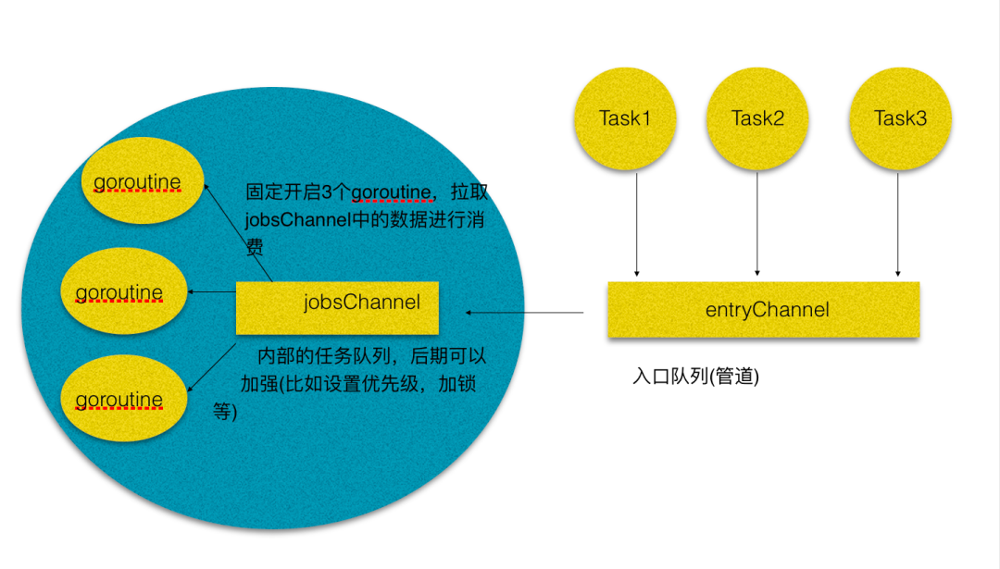

###协程池实现原理

- 首先不同的任务，请求过来，直接往entryChannel中写入，entryChannel再和jobsChannel建立通信
- 然后我们固定开启三个协程(不一定是三个，只是用三个举例子)，固定的从jobsChannel中读取数据，来进行任务处理。
- 其实本质上，channel就是一道桥梁，做一个中转的作用，之所以要设计一个jobsChannel和entryChannel，是为了解耦，entryChannel可以完全用做入口，jobsChannel可以做更深入的比如任务优先级，或者加锁，解锁等处理